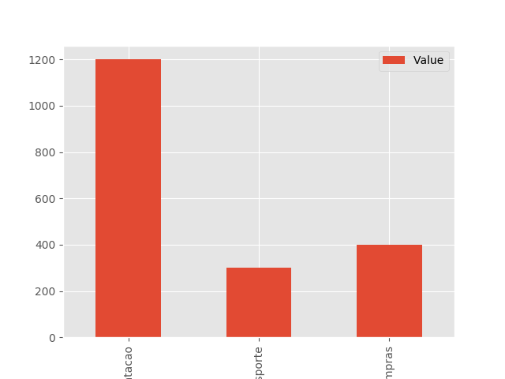
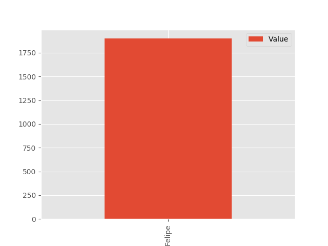
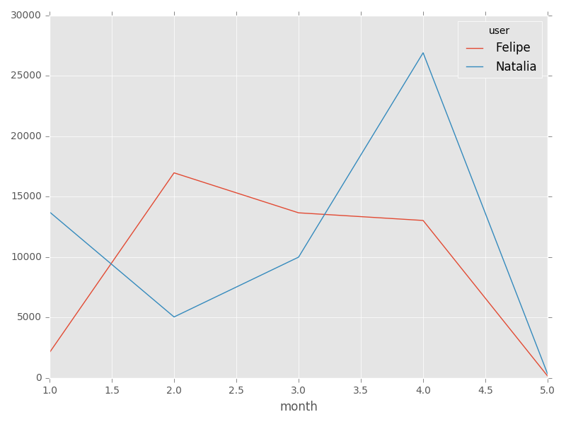

# 100 Days Of Code - Log

### Day 1:
##### Started the project [Robot Bird Watching](https://github.com/FelipeSBarros/RoBirdWatching#robotwatching-project-100daysofcode)
The [Robot Bird Watching](https://github.com/FelipeSBarros/RoBirdWatching#robotwatching-project-100daysofcode) project is a bit ambicious. So I will be developing it by baby steps and modularly. The fist module will be building a workflow of getting data, saving it on a databse, sharing thru the internet.
Started building a #python webscrapping function with #beatifulsoup module saving the result in #sqlite3;
**Today's Progress**: understood a bit more about webscrap; learned about sqlite3.

**Thoughts:** Amazed with sqlite3. Easy and fast!

**Link to work:** [Robot Bird Watching](https://github.com/FelipeSBarros/1stRoBirdWatchingModule/commit/87fb3ef51fac1908d3409b16d6731e26559d46b5)

### Day 2:
##### Enhencing [Robot Bird Watching](https://github.com/FelipeSBarros/RoBirdWatching#robotwatching-project-100daysofcode)

**Today's Progress**: Created a new python function to check if the Doodle is new or it is already on the database.

**Thoughts**: Good learning about pyhton tuples and list

**Link(s) to work**: [Robot Bird Watching](https://github.com/FelipeSBarros/1stRoBirdWatchingModule/commit/731d2433db396182d91a3b86395d8a16cbf2e7fa)

### Day 3:

**Today's Progress**: Finally in the must excite part of the project: builded a Twitter robot using #python to share the #webscrap result. Is interest, follow 'us' on [@RoBirdWatching](https://twitter.com/RoBirdWatching)

**Thoughts** Used a nice, interesting and easy-to-use module #python-twitter

**Link(s) to work**: [Robot Bird Watching](https://github.com/FelipeSBarros/1stRoBirdWatchingModule/commit/f693ec2ac4cd6cef2c9636e660df6b3a3585ac2c)

### Day 4:

**Today's Progress**: Fixed a few and small bugs in the #python functions.Also configured #crontab to execute the script every day at 9 AM on #Raspbian and it is runing nice!! I can consider the firs module of the project #done! \0/

**Thoughts** From this excercise came new ideas of projects... I nI need to organize my self to identiy which worth develop... :)

**Link(s) to work**: [Robot Bird Watching](https://github.com/FelipeSBarros/1stRoBirdWatchingModule/commit/c766e2658182b8ef1b700c9186efb84895e257c1)

### Day 5:

**Today's Progress**: Worked to put everything on a #Raspberry PI to leave running for a few days... Installed all dependecies and seems all fine! \0/

**Link(s) to work**: [Robot Bird Watching](https://gist.github.com/FelipeSBarros/d4906903b44f6d44412cd85d60c25c2d)

### Day 6: 11/01/2018

**Today's Progress**: After a small vacation, organized all scripts and functions on a #raspberry pi. Now, while the raspberry pi in active, the [@RoBirdWatching](https://twitter.com/RoBirdWatching) will look if there is a new Doodle published by Google and share it on twitter at 6:30 am

**Link(s) to work**: [Robot Bird Watching 1st Module](https://github.com/FelipeSBarros/1stRoBirdWatchingModule/commit/03efb02d1e6da83d817d65dba07d48f5934f1208)

### Day 7: 12/01/2018

**Today's Progress**: Stopped the Robot Bird Watching for a while to work on a new and quick projet: build a chat bot on #telegram to manage to-do list. Learned a lot about Telegram API, build menu, etc. Was a long day working only on this project. This gave me new ideas for chat bot.

**Link(s) to work**: [Telegram chatbot to-do list](https://github.com/FelipeSBarros/ToDoBot)

### Day 8: 13/01/2018

**Today's Progress**: Moving to a new project: #chatbot for #DomesticEconomy. it is harder then I thought.

**Link(s) to work**: [Telegram domestic economy](https://github.com/FelipeSBarros/DomesticEconomy)

### Day 9: 14/01/2018

**Today's Progress**: Worked on #DomesticEconomy #chatbot. Two steps back to consolidate the idead. Leaving all utopic UX for a later work;  
  
**Link(s) to work**: [Telegram domestic economy](https://github.com/FelipeSBarros/DomesticEconomy)

### Day 10: 15/01/2018

**Today's Progress**: Worked on #DomesticEconomy #chatbot. Organized a bit the database structure. But still not being ideal. Created a function to insert income in the database, added more categories and subcategories and a way to get subcategory accordint to a specific category;  
  
  
**Link(s) to work**: [Telegram domestic economy](https://github.com/FelipeSBarros/DomesticEconomy)

### Day 11: 16/01/2018

**Today's Progress**: Worked on #DomesticEconomy #chatbot. Created a function to retrieve summary data fromm database. **Need improvment**;  

**Link(s) to work**: [Telegram domestic economy](https://github.com/FelipeSBarros/DomesticEconomy)

### Day 12: 17/01/2018

**Today's Progress**: Worked on #DomesticEconomy #chatbot. Created functions to backup #sqlite3 database from the bot; Worked on summary function to retrieve all expenses and income;  

**Link(s) to work**: [Telegram domestic economy](https://github.com/FelipeSBarros/DomesticEconomy)

### Day 13: 18/01/2018

**Today's Progress**: #DomesticEconomy #chatbot getting better! fixed bugs on backup function and database structure. #python3 #sqlite3 @telegram  

**Link(s) to work**: [Telegram domestic economy](https://github.com/FelipeSBarros/DomesticEconomy)

### Day 14: 21/01/2018

**Today's Progress**: Worked on #DomesticEconomy #chatbot! Changed the use o #SQLite3, making use of relation tbales. Too much to change because it turned the query a bit complex.  

**Link(s) to work**: [Telegram domestic economy](https://github.com/FelipeSBarros/DomesticEconomy)

### Day 15: 22/01/2018

**Today's Progress**: Worked on #DomesticEconomy #chatbot! Finaly changed all the database schema to use relation between tables. All summary query changed to view.  

**Link(s) to work**: [Telegram domestic economy](https://github.com/FelipeSBarros/DomesticEconomy)

### Day 16: 23/01/2018

**Today's Progress**: Worked on #DomesticEconomy #chatbot! fixed bug on #sqlite3 database dump; bot running with all ald data and new structure.  

**Link(s) to work**: [Telegram domestic economy](https://github.com/FelipeSBarros/DomesticEconomy)

### Day 17 & 18: 26-27/01/2018

**Today's Progress**: Worked on #DomesticEconomy #chatbot! Created a bahs script to keep bot running na dif it breaks, to get it restarted.  

**Link(s) to work**: [Telegram domestic economy](https://github.com/FelipeSBarros/DomesticEconomy)

### Day 19: 29/01/2018

**Today's Progress**: Worked on summary function of #Telegram #DomesticEconomy #chatbot developping a summary plot with all expenses/incomes! All done with #sqlite3, #python #pandas #matplot. Next steps: send it trhu chat  

**Link(s) to work**: [Telegram domestic economy](https://github.com/FelipeSBarros/DomesticEconomy)  

   

### Day 20: 31/01/2018

**Today's Progress**: Tried a bit harder to finish #Telegram #DomesticEconomy #chatbot, but I fail.... I couldn't send the the summary plot by message...  

**Link(s) to work**: [Telegram domestic economy](https://github.com/FelipeSBarros/DomesticEconomy)  

### Day 21 & 22: 01-02/02/2018

**Today's Progress**: Finished the function to send summary data as plot by smg. #Telegram #DomesticEconomy #chatbot  

**Link(s) to work**: [Telegram domestic economy](https://github.com/FelipeSBarros/DomesticEconomy)  

### Day 23: 04/02/2018

**Today's Progress**: Improved the summary plot on #Telegram #DomesticEconomy #chatbot  

**Link(s) to work**: [Telegram domestic economy](https://github.com/FelipeSBarros/DomesticEconomy)  

### Day 24: 10/02/2018

**Today's Progress**: improved plot & summary functions on #DomesticEconomy #ChatBot which now will return values according to month and year requested, or current mount and year if both not informed. #Python #sqlite3 #telegram #tech  

**Link(s) to work**: [Telegram domestic economy](https://github.com/FelipeSBarros/DomesticEconomy)  

### Day 25: 11/02/2018

**Today's Progress**: improved backup function on #DomesticEconomy #ChatBot: now, after the backup procedure, the file is also forwarded by e-mail. #Python #sqlite3 #telegram #tech  

**Link(s) to work**: [Telegram domestic economy](https://github.com/FelipeSBarros/DomesticEconomy)  

### Day 26: 15/02/2018

**Today's Progress**: improved #DomesticEconomy #ChatBot: now, I can run few SQL functions from message; also I can add new category and subcategory. #Python #sqlite3 #telegram #tech  

**Link(s) to work**: [Telegram domestic economy](https://github.com/FelipeSBarros/DomesticEconomy)  

### Day 27: 17/02/2018

**Today's Progress**: improved #DomesticEconomy #ChatBot: now, It can be used in group. This implementation is in different branch called 'GroupAllowed'. #Python #sqlite3 #telegram #tech  

**Link(s) to work**: [Telegram domestic economy](https://github.com/FelipeSBarros/DomesticEconomy)  

### Day 28: 19/02/2018

**Today's Progress**: improved #DomesticEconomy #ChatBot: organized the README.md updateing all commands, instructions and chatbot functionalities. #Python #sqlite3 #telegram #tech  

**Link(s) to work**: [Telegram domestic economy](https://github.com/FelipeSBarros/DomesticEconomy)  

### Day 29: 23/02/2018

**Today's Progress**: Strated a new project: #ChatBot for bird watching... For now just setup the development environment #Python #sqlite3 #telegram #tech #EBird  

**Link(s) to work**: No links for now  

### Day 30: 24/02/2018

**Today's Progress**: Worked on #ChatBot for bird watching  

- [X] Learned how to request user location by chat  
- [X] worked a bit with the results requesting species occurrences using e-bird API  

#Python #sqlite3 #telegram #tech #EBird #Biodiversity #Bird #BirdWathcing  

**Link(s) to work**: [Bird Watching Assitent Bot Repository](https://github.com/FelipeSBarros/BirdWatchAssistentBot)

### Day 31: 24/02/2018

**Today's Progress**: Worked on #ChatBot for bird watching  

- [X] Improved the location request  
- [X] Finished the tool to request bird species list by location (using e-bird API);  
- [X] Started on function so user can request species photo  

#Python #sqlite3 #telegram #tech #EBird #Biodiversity #Bird #BirdWathcing  

**Link(s) to work**: [Bird Watching Assitent Bot Repository](https://github.com/FelipeSBarros/BirdWatchAssistentBot)

### Day 32-33: 27/02/2018

**Today's Progress**: Worked on #ChatBot for bird watching  

- [X] Started a function to send bird song once a bird species in selected.  

#Python @xenocanto #telegram #tech #EBird #Biodiversity #Bird #BirdWathcing  

**Link(s) to work**: [Bird Watching Assitent Bot Repository](https://github.com/FelipeSBarros/BirdWatchAssistentBot)

### Day 34: 28/02/2018

**Today's Progress**: Back to #DomesticEconomi #ChatBot:  

- [X] Fixed a few bugs;  
- [X] Enhenced small parts of code;  
- [X] Created /summary and /plot for general balance (showing sum of expenses & incomes);  
- [X] Now, bot will automatically detect when receving msg from group. No need the old branch;  

#Python #telegram #tech #sqlite

**Link(s) to work**: [Telegram domestic economy](https://github.com/FelipeSBarros/DomesticEconomy)  

### Day 35-36: 22-23/02/2018

**Today's Progress**: Back to #BirdWatchingAssistent #ChatBot:  

- [X] Get selected bird species song from XenoCanto;  
- [X] Enhenced all the code;  
- [X] Everything working smooth;  

#Python #telegram #tech #sqlite #biodiversity

**Link(s) to work**: [[Bird Watching Assitent Bot Repository](https://github.com/FelipeSBarros/BirdWatchAssistentBot)  

### Day 37: 23/03/2018

**Today's Progress**: After a month with time to work on my projects, took today to clean & organize my computer. Lets see If I find more time next days...  

### Day 38: 24/03/2018

**Today's Progress**: Back to work on a restoration spatial model, developed on #rstats. A lot to improve, but not in my priority list;   

#rstats #rspatial #tech #biodiversity #restoration

### Day 39: 04/04/2018

**Today's Progress**: Changed my #ToDo #Telegram #chatBot to #pythonanywhere using #flask #webhook. Almost 5 Hour of study to accomplish the mission :)   

**Link to work:** [ToDo ChatBot](https://github.com/FelipeSBarros/ToDoBot)

### Day 40: 05/04/2018

**Today's Progress**: Started the implementation of my #DomesticEconomy #Telegram #chatBot in #pythonanywhere using #flask #webhook.  

**Link(s) to work**: [Telegram domestic economy](https://github.com/FelipeSBarros/DomesticEconomy)

### Day 41: 06/04/2018

**Today's Progress**: Finished the transition of my #DomesticEconomy #Telegram #chatBot to #pythonanywhere using #flask #webhook.  

**Link(s) to work**: [Telegram domestic economy](https://github.com/FelipeSBarros/DomesticEconomy)

### Day 42: 07/04/2018

**Today's Progress**: Studied a bit about #Markdown in #Python. Looking forward to automate #DomesticEconomy report with it!  

**Link(s) to work**: [Telegram domestic economy](https://github.com/FelipeSBarros/DomesticEconomy)

### Day 43: 08/04/2018

**Today's Progress**: Using #markdown and #python is not easy as with #rstats. Changing my strategy, so studied a bit about handering python to #HTML to later conver to #pdf...  

**Link(s) to work**: [Telegram domestic economy](https://github.com/FelipeSBarros/DomesticEconomy)

### Day 44: 09/04/2018

**Today's Progress**: Still working with #markdown and #python. Two step backward to study and understand mora about #Pandas #MatplotLib ...  

**Link(s) to work**: [Telegram domestic economy](https://github.com/FelipeSBarros/DomesticEconomy)

### Day 45: 21/05/2018

**Today's Progress**: Another time trying to build report template with #jinja2 and #pdfkit or #weasyprint, but still difficult to render a figure!  

**Link(s) to work**: [Telegram domestic economy](https://github.com/FelipeSBarros/DomesticEconomy)

### Day 46: 22/05/2018

**Today's Progress**: Changed my strategy. Now working on #pandas data manipulation to build the month report of #DomesticEconomy #ChatBot

**Link(s) to work**: [Telegram domestic economy](https://github.com/FelipeSBarros/DomesticEconomy)

### Day 47: 23/05/2018

**Today's Progress**: Finally got some evolution on #pandas data manipulation. First graphs already structured for monthly report of #DomesticEconomy #ChatBot

**Link(s) to work**: [Telegram domestic economy](https://github.com/FelipeSBarros/DomesticEconomy)

### Day 48: 24/05/2018

**Today's Progress**: Back to report creation... still not working but, lets keep trying.

**Link(s) to work**: [Telegram domestic economy](https://github.com/FelipeSBarros/DomesticEconomy)

### Day 49: 25/05/2018

**Today's Progress**: Small improvement with #Jinja2 and report creation for my #DomesticEconomy #ChatBot

**Link(s) to work**: [Telegram domestic economy](https://github.com/FelipeSBarros/DomesticEconomy)

### Day 50: 26/05/2018

**Today's Progress**: Almost done with #Jinja2 report for #DomesticEconomy #ChatBot

**Link(s) to work**: [Telegram domestic economy](https://github.com/FelipeSBarros/DomesticEconomy)

### Day 51: 27/05/2018

**Today's Progress**: Hard times deploying the #DomesticEconomy #chatBot report....

**Link(s) to work**: [Telegram domestic economy](https://github.com/FelipeSBarros/DomesticEconomy)

### Day 52: 28/05/2018

**Today's Progress**: Tried again to deploy time sereies analysis but didn't work :/ #DomesticEconomy #chatBot

**Link(s) to work**: [Telegram domestic economy](https://github.com/FelipeSBarros/DomesticEconomy)

### Day 53: 04/06/2018

**Today's Progress**: Finally finished a function to retrieve time series expenses/incomes from #telegram #chatbot #DomesticEconomy

**Link(s) to work**: [Telegram domestic economy](https://github.com/FelipeSBarros/DomesticEconomy)

### Day 54: 09/06/2018

**Today's Progress**: Started a new project: a #python script to retrieve all of my #garmin data. So far any by steps. #selenium #bs4 #webscrap

**Link(s) to work**:

### Day 55: 10/06/2018

**Today's Progress**: Started the day with small advances on #GarminDataExport #WebScrap project. Now #selenium is working fine with #Chrome browser... #bs4 #webscrapping #Garmin

**Link(s) to work**:[GarminDataExport](https://github.com/FelipeSBarros/GarminDataExport)

### Day 56: 11/06/2018

**Today's Progress**: Everyday with small advances on #GarminDataExport #WebScrap project. #bs4 #webscrapping #Garmin

**Link(s) to work**:[GarminDataExport](https://github.com/FelipeSBarros/GarminDataExport)

### Day 57: 11/06/2018

**Today's Progress**: Had problem to download the summary data on #GarminDataExport #WebScrap project. #bs4 #webscrapping #Garmin #Selenium

**Link(s) to work**:[GarminDataExport](https://github.com/FelipeSBarros/GarminDataExport)

### Day 58: 12/06/2018

**Today's Progress**: Finally got the summary data on #GarminDataExport #WebScrap project. #bs4 #webscrapping #Garmin #Selenium #GarminConnect

**Link(s) to work**:[GarminDataExport](https://github.com/FelipeSBarros/GarminDataExport)

### Day 59: 13/06/2018

**Today's Progress**: Small steps on the webscrap to extract all my data from #GarminConnect. #GarminDataExport #WebScrap #bs4 #webscrapping #Garmin #Selenium

**Link(s) to work**:[GarminDataExport](https://github.com/FelipeSBarros/GarminDataExport)

### Day 60: 14/06/2018

**Today's Progress**: Already downloading de #GPX data from my activities. Jus need to organized the code and trnasform into functions. #GarminDataExport #WebScrap #bs4 #webscrapping #Garmin #Selenium

**Link(s) to work**:[GarminDataExport](https://github.com/FelipeSBarros/GarminDataExport)

### Day 61: 16/06/2018

**Today's Progress**: Started working on the database project to save all activities data. #GarminDataExport #pysycopg2 #SQL

**Link(s) to work**:[GarminDataExport](https://github.com/FelipeSBarros/GarminDataExport)

### Day 62: 17/06/2018

**Today's Progress**: Worked on the database integration to save all activities #GIS data on #PostGIS #PostgreSQL. #GarminDataExport #pysycopg2 #SQL

**Link(s) to work**:[GarminDataExport](https://github.com/FelipeSBarros/GarminDataExport)

### Day 63: 18/06/2018

**Today's Progress**: Still working on the #GIS database integration . #PostGIS #PostgreSQL #GarminDataExport #pysycopg2 #SQL

**Link(s) to work**:[GarminDataExport](https://github.com/FelipeSBarros/GarminDataExport)

### Day 64: 23/06/2018

**Today's Progress**: Spent some time studying about ways to append features in #PostGIS #PostgreSQL Layes with  #Gdal #pysycopg2 #SQL

**Link(s) to work**:[GarminDataExport](https://github.com/FelipeSBarros/GarminDataExport)

### Day 65: 24/06/2018

**Today's Progress**: Spent some time studying code sent by a collaborator which append features in #PostGIS #PostgreSQL from #GPX Layers... small step forward.

**Link(s) to work**:[GarminDataExport](https://github.com/FelipeSBarros/GarminDataExport)

### Day 66: 25/06/2018

**Today's Progress**: Spent some time studying [again] the code. Now looking a best way to download all data from #GarminConnect. #PostgreSQL #GPX

**Link(s) to work**:[GarminDataExport](https://github.com/FelipeSBarros/GarminDataExport)

### Day 67: 26/06/2018

**Today's Progress**: Finaly could download all activities from #GarminConnect by #webscrapping. #Selenium #python #Garmin; Next step: import to #PostgreSQL #PostGIS all the #GPX data

**Link(s) to work**:[GarminDataExport](https://github.com/FelipeSBarros/GarminDataExport)

### Day 68: 27/06/2018

**Today's Progress**: Finaly downloaded all activities from #GarminConnect by #webscrapping. Next steps: insert on #PostGIS data base and start playing with #PostgreSQL #GPX #GIS

**Link(s) to work**:[GarminDataExport](https://github.com/FelipeSBarros/GarminDataExport)

### Day 69: 29/06/2018

**Today's Progress**: Imported all #GPX activity data from #GPX to #PostGIS data base. Estarted workingon a triger for the project. #GIs #SIG #PostgreSQL

**Link(s) to work**:[GarminDataExport](https://github.com/FelipeSBarros/GarminDataExport)

### Day 70: 02/07/2018

**Today's Progress**: started to organize the repo and the idea of functions, classes and so on... #GPX #PostGIS #GIS #SIG #PostgreSQL #SQLAlchemy #SpaceTimeAnalysis

**Link(s) to work**:[GarminDataExport](https://github.com/FelipeSBarros/GarminDataExport)

### Day 71: 03/07/2018

**Today's Progress**: Organized the repo but still nedd time to improve the python functions, classes and so on... #GPX #PostGIS #GIS #SIG #PostgreSQL #SQLAlchemy #SpaceTimeAnalysis

**Link(s) to work**:[GarminDataExport](https://github.com/FelipeSBarros/GarminDataExport)

### Day 72: 07/07/2018

**Today's Progress**: Started to work on a #Python function to import all partial activities from #CSV to #PostgreSQL. Using #Pandas #SQLAlchemy #GPX #PostGIS #GIS #SIG #PostgreSQL #SpaceTimeAnalysis

**Link(s) to work**:[GarminDataExport](https://github.com/FelipeSBarros/GarminDataExport)

### Day 73: 08/07/2018

**Today's Progress**: Finished the #Python functions to import all partial activities from #CSV to #PostgreSQL. Amazed with te facility of #Pandas, #SQLAlchemy...
Next steps, start to work on space time analysis...

**Link(s) to work**:[GarminDataExport](https://github.com/FelipeSBarros/GarminDataExport)

### Day 74: 08/07/2018

**Today's Progress**: Finished the #Python functions to extract all data from garmin connect... well integrated with others function. Need to improve but already running fine.
Looking foward to start to work on space time analysis...

**Link(s) to work**:[GarminDataExport](https://github.com/FelipeSBarros/GarminDataExport)

### Day 75: 09/07/2018

**Today's Progress**: Played with #PostGIS #SQL for movement analysis, but realized that I have to make few steps back to fix #SpatialDataBase...

**Link(s) to work**:[GarminDataExport](https://github.com/FelipeSBarros/GarminDataExport)

### Day 76: 12/07/2018

**Today's Progress**: Played with #PostGIS #SQL for delta time and tryed to find a way to fix database without need to restore it...

**Link(s) to work**:[GarminDataExport](https://github.com/FelipeSBarros/GarminDataExport)

### Day 77: 13/07/2018

**Today's Progress**: Worked a bit on the old DomesticEconomy ChatBot...

**Link(s) to work**: [Telegram domestic economy](https://github.com/FelipeSBarros/DomesticEconomy)

### Day 78: 14/07/2018

**Today's Progress**: Back to Garmin project... trying to figure out a better way (I mean, easy) to import GPX to PostGIS, as I'm lost on all ogr methods and functions.

**Link(s) to work**:[GarminDataExport](https://github.com/FelipeSBarros/GarminDataExport)

### Day 79: 15/07/2018

**Today's Progress**: Finally found a better (I may say, easy) way to import #gpx to Back to #PostGIS database... Instead of using #gdal #ogr I found a easy way with #GeoPandas (read_file, to_dict) and #GeoSQLAlchemy (execute, insert).

**Link(s) to work**:[GarminDataExport](https://github.com/FelipeSBarros/GarminDataExport)

### Day 80: 16/07/2018

**Today's Progress**: Spent all night long to figure out a whay to import GeoDataFrame to postGIS keeping its SRID after converting to dict... But I did it!

**Link(s) to work**:[GarminDataExport](https://github.com/FelipeSBarros/GarminDataExport)

### Day 81: 20/07/2018

**Today's Progress**: Spent all night long organizing and transforming the script created to a function to import #GPX to #postGIS...Still have things to finish, but it is a start...

**Link(s) to work**:[GarminDataExport](https://github.com/FelipeSBarros/GarminDataExport)

### Day 82: 21/07/2018

**Today's Progress**: still orking on functions workflow... what a mess I did...

**Link(s) to work**:[GarminDataExport](https://github.com/FelipeSBarros/GarminDataExport)

### Day 83: 29/07/2018

**Today's Progress**: Back to project Garmin Extract Data: refactoring all functions and learning more about #Selenium!

**Link(s) to work**:[GarminDataExport](https://github.com/FelipeSBarros/GarminDataExport)

### Day 84: 30/07/2018

**Today's Progress**: Refactoring all functions with class and #Selenium methods... learning a lot about #Selenium!

**Link(s) to work**:[GarminDataExport](https://github.com/FelipeSBarros/GarminDataExport)

### Day 85: 31/07/2018

**Today's Progress**: Refactoring all functions... getting interesting! but alot todo...

**Link(s) to work**:[GarminDataExport](https://github.com/FelipeSBarros/GarminDataExport)

### Day 86: 2/08/2018

**Today's Progress**: Started to work on database setup...

**Link(s) to work**:[GarminDataExport](https://github.com/FelipeSBarros/GarminDataExport)
